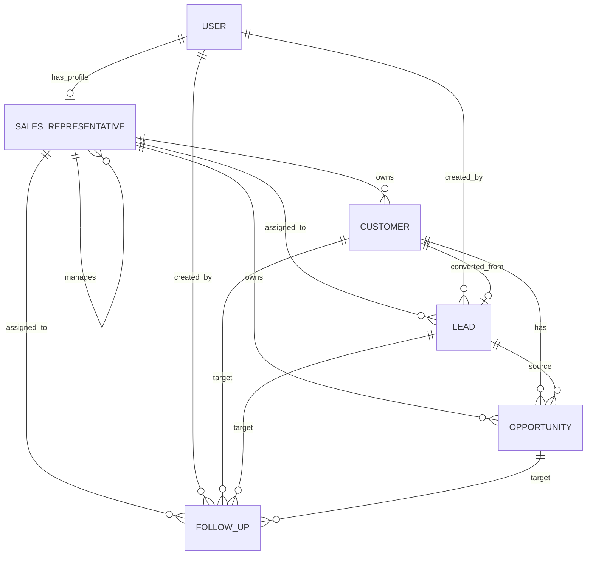

# CRM Lite Database Design

## ER Diagram

## Relationship explanation

- `User` is the authentication model for the platform. It stores login credentials and role metadata.
- `SalesRepresentative` is a one-to-one extension of `User`. Only users with `SALES_REP` or `SALES_MANAGER` roles can have a sales profile.
- `SalesRepresentative.manager` is a self-referencing foreign key that models reporting hierarchy.
- `Customer.owner` points to the sales representative responsible for the customer account.
- `Lead.assigned_to` points to the sales representative currently handling the lead.
- `Lead.converted_customer` creates an optional one-to-one conversion path from lead to customer.
- `Opportunity.customer` ties every opportunity to exactly one customer.
- `Opportunity.lead` optionally preserves the lead that originated the deal.
- `Opportunity.owner` points to the sales representative responsible for the deal.
- `FollowUp` belongs to exactly one target entity:
  - `Customer`, or
  - `Lead`, or
  - `Opportunity`
- `FollowUp.assigned_to` identifies the sales representative expected to execute the activity.
- `Lead.created_by` and `FollowUp.created_by` preserve audit ownership from the application user side.

## Migration order

1. `users.0001_initial`
   - Creates the custom `User` model first.
   - Creates `SalesRepresentative`, which depends on `User`.
2. `crm.0001_initial`
   - Creates base CRM tables without cross-app foreign keys.
3. `crm.0002_initial`
   - Adds relationships from CRM tables to `users` and to each other.
   - Adds indexes and constraints after the dependent tables exist.

## Validation and constraints summary

- `User.email` is unique.
- `SalesRepresentative.commission_rate` is constrained to `0..100`.
- `SalesRepresentative.manager` cannot reference the same record.
- `Customer` requires at least one contact method: email or phone.
- `Customer.email` is unique case-insensitively when present.
- `Business` customers must include `company_name`.
- `Lead` requires at least one contact method: email or phone.
- `Lead.estimated_value` must be non-negative.
- `Lead.status=CONVERTED` requires `converted_customer`, and the reverse must also hold.
- `Opportunity.amount` must be non-negative.
- `Opportunity.probability` is constrained to `0..100`.
- Closed opportunities must use stage `WON` or `LOST` and include `closed_at`.
- `FollowUp` must target exactly one parent record.
- `FollowUp.completed_at` is only allowed when status is `COMPLETED` and cannot be earlier than `scheduled_at`.
